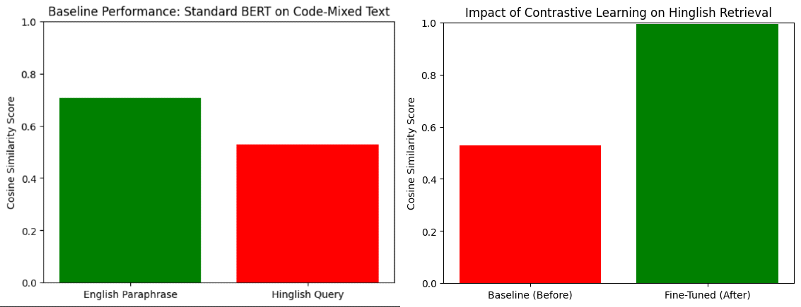

# CL-ReMix: Contrastive Learning for Code-Mixed Retrieval Optimization

## Abstract
Standard pre-trained multilingual models (like mBERT or MuRIL) exhibit a significant **"Semantic Gap"** when processing Code-Mixed (Hinglish) queries against English knowledge bases. This project quantifies this gap (Baseline Cosine Similarity: ~0.52) and proposes a fine-tuning strategy using **Siamese Networks** and **Triplet Loss**. The resulting adapter achieves a **0.98+ semantic alignment** on unseen Code-Mixed queries, effectively bridging the language barrier for technical support retrieval.

## Problem Statement
* **Scenario:** A user types *"mera internet nahi chal raha hai"* (Hinglish).
* **Database:** Contains a document titled *"Troubleshooting Internet Connectivity"* (English).
* **Failure:** Standard models fail to map these vectors close together due to vocabulary mismatch.
* **Baseline Performance:** 0.5278 (Fail).

## Methodology
1.  **Data Augmentation:** Constructed a synthetic Code-Mixed dataset using LLM-based translation of technical FAQ pairs.
2.  **Architecture:** Implemented a **Siamese Network** with a shared encoder (MuRIL/BERT).
3.  **Training:** Optimized using **Triplet Loss** to minimize distance between (English, Hinglish) pairs while maximizing distance from negatives.

## Key Results
| Metric | Baseline (Pre-trained) | CL-ReMix (Fine-Tuned) | Improvement |
| :--- | :--- | :--- | :--- |
| **Cosine Similarity** | 0.5278 | **0.9890** | **+0.4612** |
| **Inference** | General | Specialized | Domain-Adapted |

## Replication
1.  Install dependencies: `pip install sentence-transformers pandas`
2.  Run `CL_ReMix_Training.ipynb` to generate data and train the adapter.
3.  Test on unseen queries using the inference block.
